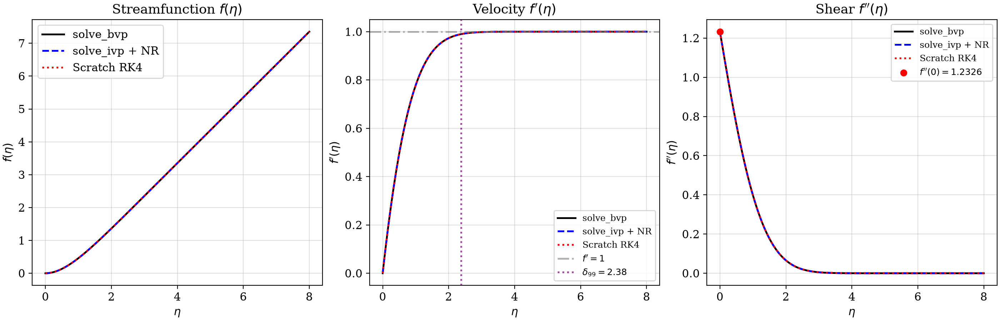
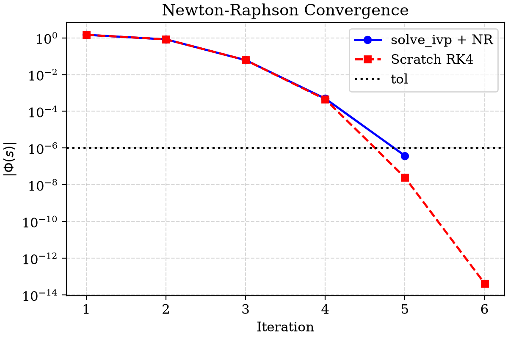
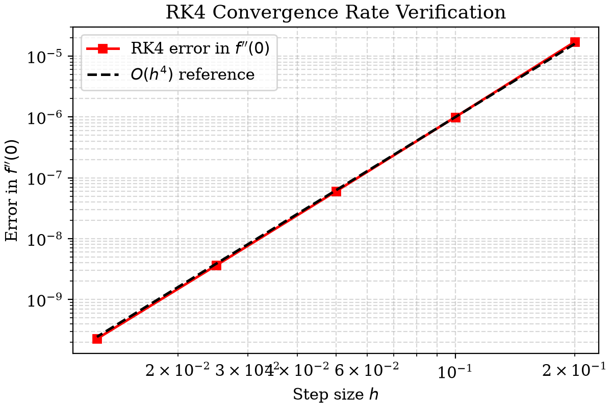

# Assignment 01 — Falkner-Skan Stagnation Point Flow

Numerical solution of $f''' + ff'' - (f')^2 + 1 = 0$ with $f(0)=0$, $f'(0)=0$, $f'(\infty)=1$ using three approaches.

## Files

```
Assignment_01_24JE0271/
├── main.py                        ← run this
├── REQUIREMENTS.txt
├── src/
│   ├── solve_bvp_approach.py      Approach 1: solve_bvp (collocation)
│   ├── solve_ivp_newton.py        Approach 2: solve_ivp + Newton-Raphson
│   └── scratch_rk4_newton.py      Approach 3: RK4 + Newton-Raphson from scratch
├── latex_report/
│   ├── report.tex                 LaTeX report (compile on Overleaf)
│   ├── comparison_table.tex       auto-generated by main.py
│   └── figures/                   auto-generated by main.py
└── figures/                       plots saved here after running main.py
```

## Setup

```bash
git clone https://github.com/HibernatingBunny067/Assignment_01_24JE0271.git
cd Assignment_01_24JE0271
python3 -m venv .venv
source .venv/bin/activate
pip install -r REQUIREMENTS.txt
```

## Running

```bash
python main.py              # runs all three methods, saves plots + LaTeX table

# or run each approach individually
python src/solve_bvp_approach.py
python src/solve_ivp_newton.py
python src/scratch_rk4_newton.py
```

Plots → `figures/`. LaTeX table + figures → `latex_report/` (upload this folder to Overleaf).

## Results






----