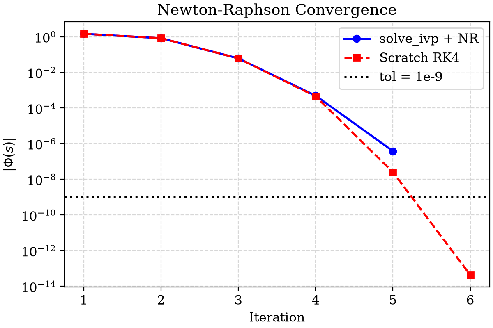
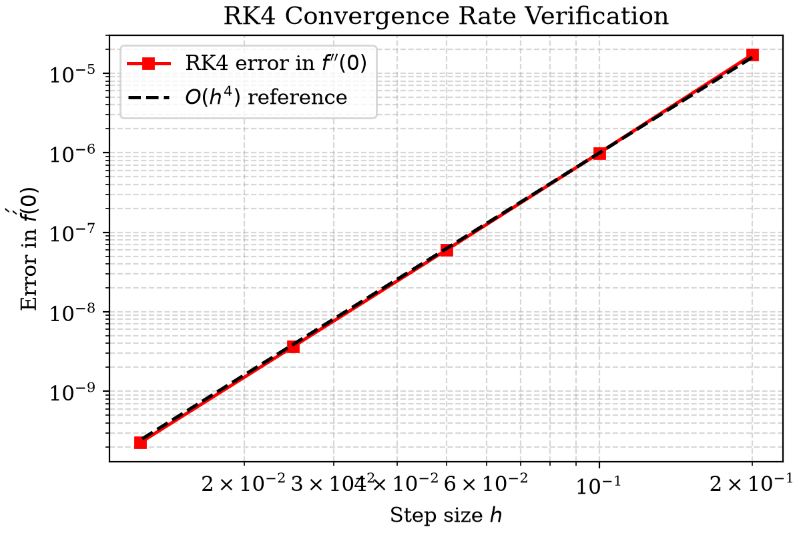

# Assignment 01 — Falkner-Skan Stagnation Point Flow

Numerical solution of $f''' + ff'' - (f')^2 + 1 = 0$ with $f(0)=0$, $f'(0)=0$, $f'(\infty)=1$ using three approaches.

## Files

| File | Description |
|---|---|
| `solve_bvp_approach.py` | Approach 1: `scipy.integrate.solve_bvp` (collocation) |
| `solve_ivp_newton.py` | Approach 2: `scipy.integrate.solve_ivp` + Newton-Raphson shooting |
| `scratch_rk4_newton.py` | Approach 3: RK4 + Newton-Raphson, written from scratch (no scipy) |
| `main.py` | Runs all three, prints results, saves plots and LaTeX table |
| `report.tex` | LaTeX report — compile on Overleaf with `comparison_table.tex` and `figures/` |

## Setup

```bash
python3 -m venv .venv
source .venv/bin/activate
pip install -r REQUIREMENTS.txt
```

## Running

```bash
python main.py              # runs all three methods, saves plots + LaTeX table

# or run each approach individually
python solve_bvp_approach.py
python solve_ivp_newton.py
python scratch_rk4_newton.py
```

Plots are saved to `figures/`. The LaTeX table is written to `comparison_table.tex`.

## Results





----